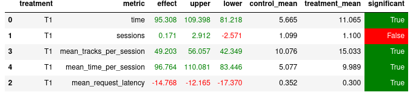

# Решение домашней работы

## Идеи по улучшению

1. Поразбирался с тем, как работает рекоменедер и мне кажется, что реализована немного не та идея, которая
    изначально задумывалась. Если я правильно понял, то задумка была такая: первый трек идеален, поэтому найдем наилучшие,
    которые можно предложить после него. Идея хорошая, но проблема в том, что
    `recommend_next(user, prev_track, prev_track_time)` принимает предыдущий, а не начальный трек. Это значит, что уже
    на второй рекомендации будем подбирать трек не к начальному треку. А это уже не хорошо: если предлагаем такой трек,
    который не нравится пользователю, то каждый следующий уже не обязан быть хорошим (только если случайно повезет).
    Идея работала бы, если бы передавали не `prev_track`, а `first_track`.

    Как исправил: буду хранить первую песню пользователя в сессии и именно ее передавать `prev_track` (который переименую в
    в `first_track`).

2. В рекомендере для песен, про которые ничего не знаем, используем рандомный рекомендер. Кажется, что если использовать
   рекомендер получше в fallback, то качество вырастет. Возьму `TopPop`.

3. Воспользуюсь данными последнего нейросетевого рекомендера. Понятно, что чем лучше данные (больше хороших последовательностей
   песен), тем лучше выучим модель.

## Результаты

Новый рекомендер на 110% лучше нейросетевого.

### Дополнительные идеи, которые можно было бы реализовать

1. Для улучшения разнообразия хорошо бы каждый раз использовать не только похожие на первый, а хранить историю пользователя 
    и каждый раз, например, выбирать песню из списка с вероятностью пропорциональной времени прослушивания. 
    Это будет трек, на основе которого выбираем следующий и к нему уже применяем модель.
    
    Это будет работать, потому что рекомендер уже умеет давать хорошие рекомендации (1.0 не только для первой песни).
    И мы вполне можем их использовать в качестве тех, от которых отталкиваться.

2. Для песен, про которые знаем рекомендации, выбираем случайно новую рекомендацию. Это не хорошо, потому что
   песни в этом случае могут повторяться (пользователь уже их слышал). Исправляется опять с использованием истории
   (каждый раз проверять, что песня новая).

3. В нейросетевом рекомендере выучиваем, какую песню X стоит поставить после Y, чтобы максимизировать время
прослушивания X. В этом подходе есть очевидный минус: никак не используем информацию о пользователе.

Легко представить такую ситуацию: пусть X и Y разных жанров. Выучили по одному пользователю, который любит оба жанра, что
надо рекомендовать X. Но при запуске другому пользователю, который не фанат жанра X, такая рекомендация не будет подходить.

Это можно было бы исправить, например, дополнительно выучивая эмбеддинги для пользователей.

## Файлы

* `hw/README.md` - описание решения.
* `botify/botify/recommenders/best.py` - реализация рекомендера, который скромно называется `Best`
* [Данные](https://drive.google.com/file/d/1eorypqIUAdRi2q5wBLQPpzC-78PObY_D/view?usp=sharing), которые собрал
с помощью последнего нейросетевого рекомендера
* `hw/model_training.ipynb` - обучение модели
* `botify/data/seq_recommended_tracks.json` - рекомендации, полученные после обучения
* `hw/experiment.json` - данные эксперимента (сравниваю нейросетевой и новый; другие понятно, что будут хуже)
* `hw/evaluation.ipynb` - сравнение нового рекомендера с нейросетевым

## Запуск

1. Собрать датасет с помощью нейросетевого рекомендера. Использовал:

    `--episodes 20000 --config config/env.yml multi --processes 4`
2. Обучить модель на данных: `hw/model_training.ipynb`. Получить рекомендации.
3. Запустить эксперимент с рекомендером `Best` и `Contextual`. Использовал:
 
    `--episodes 2000 --config config/env.yml single --recommender remote`
4. Проверить, что рекомендер действительно лучше, запустив `hw/evaluation.ipynb`.
